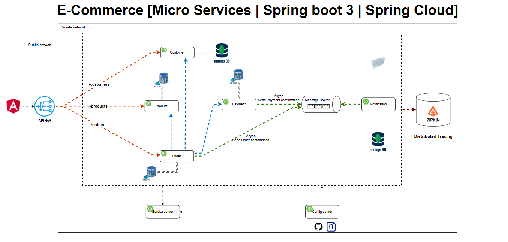

# E-commerce Microservices with Spring Boot and Spring Cloud

A production-style microservices system for e-commerce, demonstrating clean domain boundaries, centralized configuration, service discovery, secure API ingress, event-driven communication, and observability. This repository is presentation-ready for hiring teams and technical reviewers.

## High-Level Architecture

- API Gateway (Reactive) as the single entry point: routing, security, and cross-cutting policies
- Service Discovery with Eureka for dynamic registration and client-side load balancing
- Config Server for centralized externalized configuration (per-service, per-profile)
- Domain Microservices
  - Customer Service: customer profiles (MongoDB)
  - Product Service: catalog and inventory (PostgreSQL)
  - Order Service: order orchestration (PostgreSQL, Kafka producer)
  - Payment Service: payment workflow (PostgreSQL, Kafka producer)
  - Notification Service: consumes events and notifies (MongoDB/Kafka consumer)
- Security: OAuth2/JWT via Keycloak, Gateway as Resource Server
- Messaging: Kafka for order/payment events and decoupled workflows
- Observability: Zipkin tracing + Spring Boot Actuator
- Optional: Redis-backed rate limiting at Gateway, CI/CD toolchain (Jenkins, SonarQube, Nexus, Tomcat)

## Architecture Diagram (placeholder)

Place your architecture image at the path below (do not auto-generate):

## Service Routing (via Gateway)

Gateway Base URL: http://localhost:8222

- /api/v1/customers → `CUSTOMER-SERVICE`
- /api/v1/products → `PRODUCT-SERVICE`
- /api/v1/orders → `ORDER-SERVICE`
- /api/v1/payments → `PAYMENT-SERVICE`

Service discovery names and routes are configured centrally in `services/config-server/src/main/resources/configurations/`.

## Security Model

- OAuth2/JWT with Keycloak (`http://localhost:9098/realms/microservices-realm`)
- Gateway validates JWT and applies authorization policies
- Internal service-to-service flows are supported through the gateway; sensitive endpoints can be authenticated or allowlisted as needed
- Ready for role-based access control (RBAC) and scope-based authorization

## Messaging & Data

- Kafka: asynchronous events for order/payment confirmation
- PostgreSQL: relational stores for orders, products, and payments
- MongoDB: document stores for customers and notifications

## Observability

- Zipkin distributed tracing
- Spring Boot Actuator endpoints for health and metrics

## Optional Platform Capabilities

- Redis rate limiting at the Gateway (token-bucket design)
- CI/CD blueprint: Jenkins (pipelines), SonarQube (quality gates), Nexus (artifact repository), Tomcat (WAR deployment)

## Local Port Mapping

Core Platform
- API Gateway: 8222
- Service Discovery (Eureka): 8761
- Config Server: 8888
- Zipkin: 9411

Security & Messaging
- Keycloak (Auth Server): 9098
- Kafka (external broker): 29092
- Zookeeper: 2181

Datastores
- PostgreSQL: 5432
- MongoDB: 27017
- Redis (optional for rate limiting): 6379

Domain Services
- Customer Service: 8090
- Product Service: 8050
- Order Service: 8070
- Payment Service: 8060
- Notification Service: (configured in discovery; exposed through Gateway)

CI/CD (Optional, for demonstration)
- Jenkins: 8080
- SonarQube: 9000
- Nexus Repository: 8081
- Apache Tomcat: 8888 (note: ensure no conflict with Config Server when running together)

## What Reviewers Should Notice

- Clean separation of concerns (Gateway, Discovery, Config, Domain Services)
- Production-minded patterns: externalized config, discovery, tracing, messaging
- Secure ingress with OAuth2/JWT at the Gateway
- Extensible design for rate limiting, resilience, and CI/CD

## Notes

- Centralized configs live in `services/config-server/src/main/resources/configurations/*.yml`
- All service traffic enters via the Gateway for consistent policies and load balancing
- The architecture image is intentionally external—add your final diagram at `docs/architecture.png`
